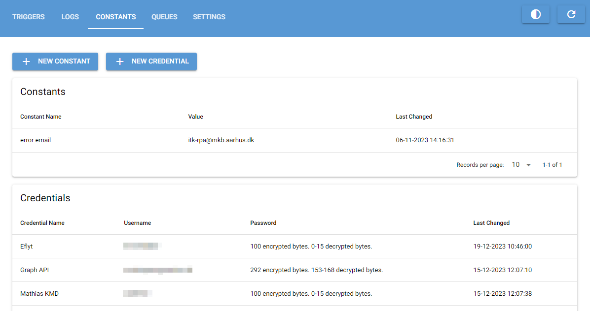

# Constants
{:.no_toc}

## Table of Contents
{:.no_toc}
- TOC
{:toc}

## Intro

The constants tab is where you view, edit and add constants and credentials.

**Constants** are pairs of names and values. Use this to define constants or config values that should be used across
multiple automation processes.

**Credentials** has a name, username and password and are used to store login credentials used in automation
processes in a safe and central location.

---

## Description of the UI

1. Table constants.
2. Table of credentials.
3. Control buttons.



### Control Buttons

The **Update** button updates the tables with the information in the database.
At the moment the tables will not automatically update.

The **Delete** button will delete the selected trigger. This is permanent and can't be reversed.

The **New constant** and **New credential** buttons are used to create new constants and credentials.

---

## Creating new constants

When creating a new constant the following pop-up is shown:


**Name**: The name of the constant. This must be unique from other constants' names.
If you try to create a new constant with an existing name you'll overwrite the existing one.

**Value**: The value of the constant. Note that this is a string value and will need to be converted by the 
automation process if needed.

---

## Creating new credentials

When creating a new credential the following pop-up is shown:


**Name**: The name of the credential. This must be unique from other credentials' names.
If you try to create a new credential with an existing name you'll overwrite the existing one.

**Username**: The username of the credential.

**Password**: The password of the credential. The password is encrypted using the encryption key
defined in the Settings tab before being sent to the database. The shown value in the table 
is the encrypted password. There is no way to retrieve unencrypted passwords from Orchestrator.

---

## Editing existing constants and credentials

To edit an existing constant or credential simply double-click it in the table.

---

## Complex values and secrets

Since both constants and credentials store their values, usernames and passwords as
raw strings, you can easily insert csv, json or base64 strings into the tables if
your automation processes needs it.

An example could be API credentials where you not only have a password but also a tenant and client id.
This could be inserted into the password field of a credential as:

```json
{"password": "Hunter2", "client_id": "52a8ff3c-0ea0-4e0f-998b-a64803de09b8", "tenant_id": "1c3de1da-f17b-4a00-a833-a4307a08c1a8"}
```

This can then easily be unpacked as part of your automation process and it won't bloat your credentials.