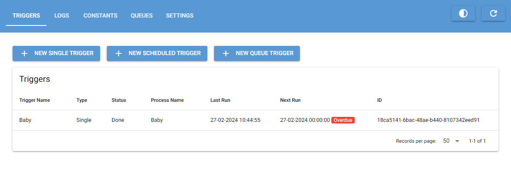

# Triggers
{:.no_toc}

## Table of Contents
{:.no_toc}
- TOC
{:toc}

## Intro

The 'Triggers' tab is where the running schedule for the automation processes is defined.

There are 3 different kinds of triggers:
- **Scheduled triggers**: Run the process at a given interval defined using cron expressions.
- **Queue triggers**: Run the process when a database queue reaches a minimum number of elements.
- **Single triggers**: Run the process once at a given date and time.

## Description of the UI

1. Overview of scheduled triggers.
2. Overview of Queue triggers.
3. Overview of Single triggers.
4. Control buttons.

### Control buttons

The **Update tables** button updates all three trigger tables with the information in the database.
At the moment the tables will not automatically update.

The **Enable** button is used to enable the selected trigger if it is currently Paused, Done or Failed.

The **Disable** button sets the selected trigger to Paused.

The **Delete** button deletes the selected trigger. This is permanent and can't be reversed.

The three **New trigger** buttons are used to create new triggers.

---

## Creating new scheduled triggers

When creating a new scheduled trigger the following pop-up is shown:

**Trigger name**: The name of the trigger to be shown in the trigger table.

**Process name**: The name of the process. This will be shown in the triggers tab as 
well as any logs created by the process.

**Cron expression**: The run interval of the process described as a cron expression.
Use the help link if you don't know how to write cron expressions.

**Process path**: The absolute path to the process on the computer or
a URL to the git repo hosting the process.

**Arguments**: Arguments to be passed to the process at runtime.
This value is passed as a raw string. It's recommended using a json string for more
complex arguments.

**Is git repo?**: Toggle this on if the process path given is a URL to a git repo.

**Is blocking?**: If this is off the process is allowed to run parallel to other
non-blocking processes. If it's on the process will always run alone
on the worker machine.

---

## Creating Queue triggers

When creating a new queue trigger the following pop-up is shown:

**Trigger Name**: The name of the trigger to be shown in the trigger table.

**Process Name**: The name of the process. This will be shown in the triggers tab as 
well as any logs created by the process.

**Queue Name**: The name of the queue associated with this trigger.

**Min batch size**: The minimum number of elements in the queue before triggering the
process.

**Process Path**: The absolute path to the process on the computer or
a URL to the git repo hosting the process.

**Arguments**: Arguments to be passed to the process at runtime.
This value is passed as a raw string. It's recommended using a json string for more
complex arguments.

**Is git repo?**: Toggle this on if the process path given is a URL to a git repo.

**Is blocking?**: If this is off the process is allowed to run parallel to other
non-blocking processes. If it's on the process will always run alone
on the worker machine.

---

## Creating single triggers

When creating a new single trigger the following pop-up is shown:

**Trigger Name**: The name of the trigger to be shown in the trigger table.

**Process Name**: The name of the process. This will be shown in the triggers tab as 
well as any logs created by the process.

**Trigger Date**: The date to trigger the process.

**Trigger Time**: The time on trigger date to trigger the process.

**Process Path**: The absolute path to the process on the computer or
a URL to the git repo hosting the process.

**Arguments**: Arguments to be passed to the process at runtime.
This value is passed as a raw string. It's recommended using a json string for more
complex arguments.

**Is git repo?**: Toggle this on if the process path given is a URL to a git repo.

**Is blocking?**: If this is off the process is allowed to run parallel to other
non-blocking processes. If it's on the process will always run alone
on the worker machine.

---

## Editing an existing trigger

To edit an existing trigger simply double-click it in the tables.