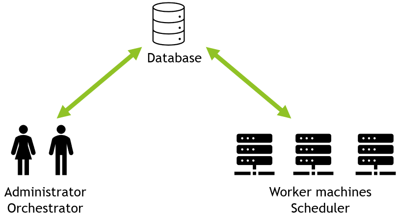

# Home

This documentation introduces the OpenOrchestrator project v1.0.0.

## Reading these docs

This doc-site is written in a way that's meant to be read from A to Z.
To get the full understanding of OpenOrchestrator it's recommended to go
through all pages from top to bottom in order, reading the entire pages.

## What is OpenOrchestrator?

OpenOrchestrator is used to manage automated processes running on dedicated worker machines.
The primary focus while developing has been to make deployment of RPA solutions as easy as possible.

The design goals of OpenOrchestrator are:

- To be simple and easy to use.
- To run processes automatically based on simple scheduling rules.
- To make scaling up or down as simple as possible.
- To make everything asynchronous.
- To give administrators full control of their setup and data.
- To use as many standard components as possible.

A very simple drawing of how OpenOrchestrator works can be seen below:

A database holds all information regarding the automation processes:

- Schedules
- Logs
- Constants
- Credentials

Administrators uses an app named 'Orchestrator' to control and view the data in the database,
and another app named 'Scheduler' runs on the worker machines reading the data from the database
and launches processes as needed.

With this simple setup it's theoretically possible to have an unlimited number of administrators 
and worker machines, with the ability to add and remove them as needed.